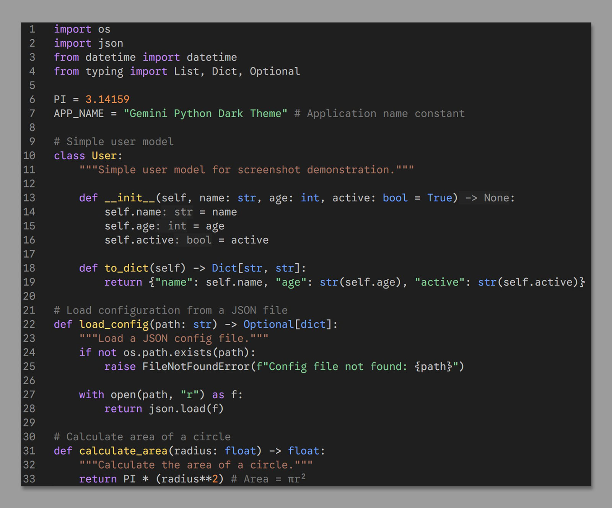

# **Gemini Python Dark Theme**

  
  
  
  

A dark, high‑contrast Visual Studio Code theme inspired by the color palette used by Gemini for Python code.

## 📸 Screenshots

## ✨ Features

- Dark, neutral background optimized for long coding sessions
- Vibrant syntax colors inspired by Gemini’s Python styling
- Carefully tuned contrast for readability without eye strain
- Clean UI elements that stay out of your way
- Tailored primarily for Python, but works beautifully across all languages

## 📦 Installation

### From the VS Code Marketplace

1. Open **Extensions** sidebar
2. Search for **Gemini Python Dark Theme**
3. Click **Install**
4. Select the theme:
   - **File → Preferences → Color Theme**
   - Choose **Gemini Python Dark Theme**

## 🎨 Activating the Theme

You can switch to the theme using:

### Command Palette

1. Press **Ctrl+Shift+P**
2. Type **Preferences: Color Theme**
3. Select **Gemini Python Dark Theme**

## 📝 License

This theme is released under the **MIT License**.
